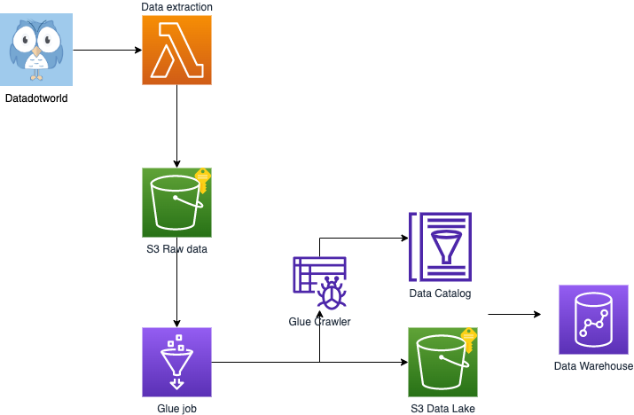

# uber-movement-data-lake

## Introduction

The goal of this challenge is to automate the build of a scalable, efficient, highly available and well organized data lake using the dataset provided due to be consumed for some ETL pipelines.
To take into account:
- The Data Lake should be optimized for searching. Keep in mind that a data warehouse is the final stage for this data.
- The data should be secure.

A data lake is a centralized repository that allows to store all structured and unstructured data at any scale. An effective data lake architecture should be able to work on all data types with reduced effort in ingestion and store large volumes of data cost-efficiently.


## Architecture

The data lake was implemented using the services offered by AWS Cloud. This platform is cost-effective, scalable, and secure, and it offers a wide range of services and tools that can be used to build, monitor, and secure data lakes.

All the resources needed by this workloads are handled by CloudFormation, an IaC solution which allows to configure and deploy resources through a template, writing the specification to your application environment in the same way you'd write a configuration file.
The building automation consists of various steps described below.


### Data Extraction and storage
The extraction and storage in persistent place as s3 is performed as quickly and simply as possible using a AWS lambda, a serverless compute service that allows to run codes asynchronosusly, using the python library to work with data.world datasets (https://pypi.org/project/datadotworld/). 
The lambda function stores data in its raw format and does not perform any further processing. This data will be used in the next steps for further processing.

### Data Load and transformation
There are some operations that can be performed to make the data lake more efficient:
- **formatting**:
  A data warehouse is the final stage for data, therefore most reads are going to be analytical queries. Transforming the data to a columnar format such as parquet or ORC enables better compression of the data and the ability to access only specific columns, which reduces the amount of data scanned during querying time.
- **partitioning**: 
  Since the Data Lake should be optimized for searching, it is useful to partition the data so that you can search for the answer in the right place. When performing a query, you would like to scan as little data as possible in order to get results. Partitioning will navigate the query engine to the right place in which the data resides.
- **compaction**: 
  It is important to partition the data in order to improve the performance of the data lake using s3 as storage layer. However, this should be done in a way that does not generate a large number of small files.

The process of  transforming raw data and loading into a data lake bucket is handled by a Glue Workflow. This workflow triggers a transformation Glue job, which in turn automatically runs a crawler once the job is completed. The crawler then adds a metadata layer populating the data catalog based on the data uploaded to s3 by the job.
The actions performed by the Glue job include:
- converting data to columnar storage type parquet 
- partitioning data by the city, the bucket path contains the city as prefix (_bucket://uber/{city}/file.parquet_) and the crawler will create one partition for each one
- the "date_range" column is split into date_range_start, date_range_end, date_range_frequency and date_range_type, this enables searching for specific data ranges.

### Data security
  Data security is ensured by:
  - data encryption: the objects in the s3 bucket are  encrypted using server-side encryption with AWS Key Management Service (AWS KMS) keys.
  - managing  access to s3 resources using access policy options and creating user policies associated with IAM users, groups and roles for the consumers of the data lake. All the resources in the pipeline have an associated role that defines what can be done on which resources.


## Launch
- Create an AWS account (if not present) and make sure to have awscli installed and configured in your system.
- Install sam cli https://docs.aws.amazon.com/serverless-application-model/latest/developerguide/install-sam-cli.html.
- Clone this repository and go to _sam-app_ folder. Then run:
```bash
sam build
sam deploy -g
```
